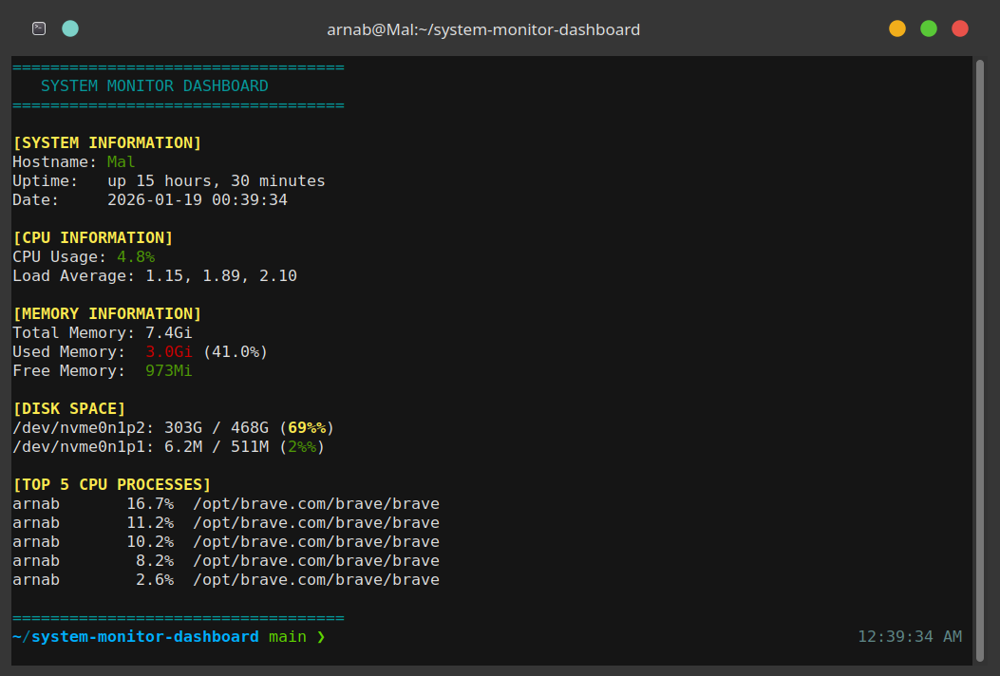

# System Monitor Dashboard 🖥️ :

A lightweight, colorful command-line system monitoring tool for Linux that displays real-time system information including CPU usage, memory stats, disk space, and top processes.


## Features ✨

- **CPU Monitoring**: Real-time CPU usage and load average
- **Memory Stats**: Total, used, and free memory with percentage
- **Disk Space**: Disk usage with color-coded warnings
- **Process Tracking**: Top 5 CPU-consuming processes
- **System Info**: Hostname, uptime, and current date/time
- **Colorful Output**: Easy-to-read color-coded display


## Screenshots 📸



The dashboard displays real-time system information with color-coded output for easy monitoring.

- System hostname, uptime, and current date/time
- CPU usage (4.8%) and load averages
- Memory usage (3.0Gi used / 7.4Gi total - 41.0%)
- Disk space with color warnings (69% and 2% usage shown)
- Top 5 CPU-consuming processes

## Prerequisites 📋

- Linux operating system
- Bash shell (version 4.0 or higher)
- Standard utilities: `top`, `free`, `df`, `ps`, `awk`

## Installation 🚀

1. Clone the repository:
```bash
git clone https://github.com/YOUR_USERNAME/system-monitor-dashboard.git
```

2. Navigate to the project directory:
```bash
cd system-monitor-dashboard
```

3. Make the script executable:
```bash
chmod +x sysmonitor.sh
```

## Usage 💻

Run the monitor:
```bash
./sysmonitor.sh
```

### Auto-Refresh Mode (Optional)

To run the monitor with auto-refresh every 5 seconds, you can modify the script or run:
```bash
watch -n 5 ./sysmonitor.sh
```

## Configuration ⚙️

You can customize the script by editing the following:

- **Colors**: Modify the color codes at the top of the script
- **Disk Warning Thresholds**: Change the percentage values in `show_disk_info()` function
- **Number of Processes**: Modify the `head` count in `show_top_processes()` function

## Project Structure 📁
```
system-monitor-dashboard/
├── sysmonitor.sh       # Main monitoring script
├── README.md           # Project documentation
└── LICENSE             # License file
```

## How It Works 🔧

The script uses standard Linux utilities:
- `top` - For CPU usage statistics
- `free` - For memory information
- `df` - For disk space usage
- `ps` - For process information
- `uptime` - For system uptime and load average

All data is formatted using `awk` and displayed with ANSI color codes for better readability.

## Contributing 🤝

Contributions are welcome! Here's how you can help:

1. Fork the repository
2. Create a new branch (`git checkout -b feature/improvement`)
3. Make your changes
4. Commit your changes (`git commit -am 'Add new feature'`)
5. Push to the branch (`git push origin feature/improvement`)
6. Create a Pull Request

## Future Enhancements 🚀

- [ ] Add network statistics (upload/download speeds)
- [ ] Temperature monitoring support
- [ ] Save statistics to log file
- [ ] Alert system for critical thresholds
- [ ] Interactive menu for different views
- [ ] JSON export option
- [ ] Configuration file support

## License 📄

This project is licensed under the MIT License - see the [LICENSE](LICENSE) file for details.

## Author ✍️

Created with ❤️ by [Your Name]

## Acknowledgments 🙏

- Inspired by various Linux monitoring tools
- Thanks to the open-source community

## Support 💬

If you found this project helpful, please give it a ⭐️!

For bugs or feature requests, please open an issue.

---

**Note**: This tool is designed for Linux systems. Some features may not work on other Unix-like systems without modification.
